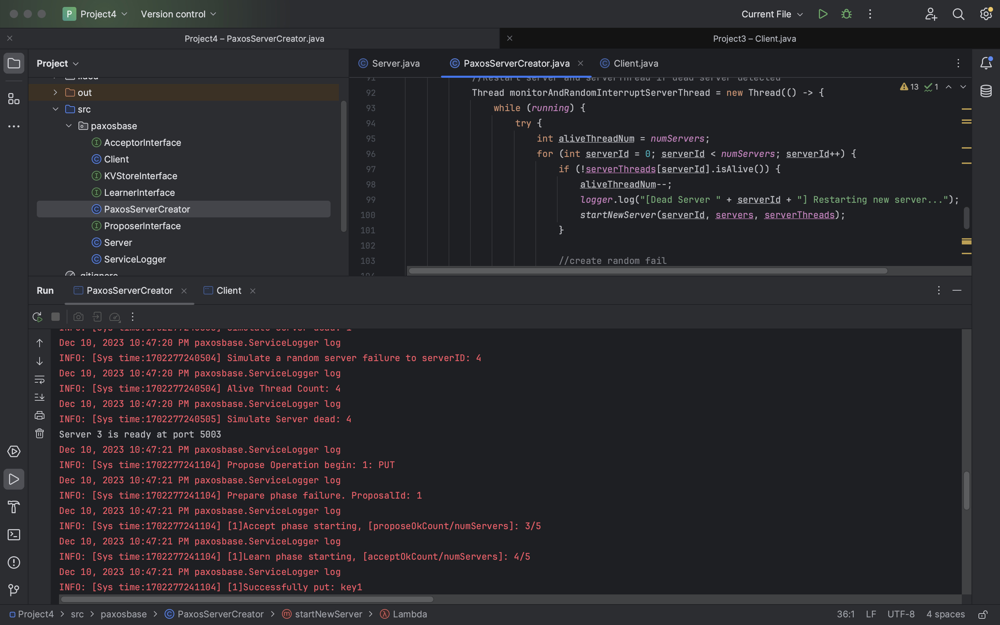
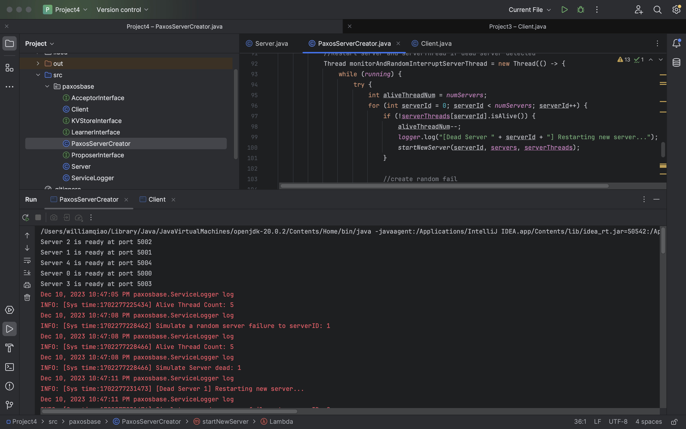
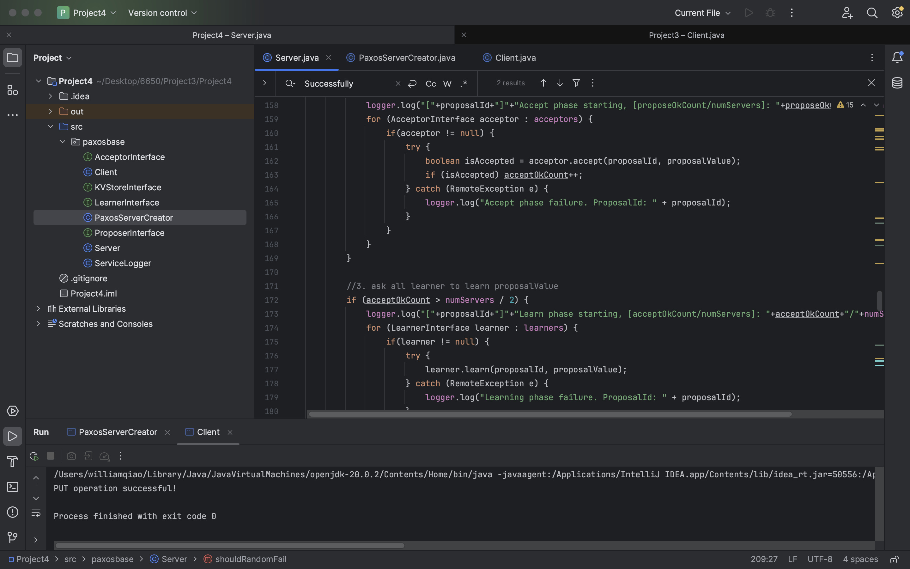

# PAXOS and Random Fail-Stop Restart Handle - Project 4 - README

#### terminal screenshots

* Server Propose and Accept Phase
  
* Server Random Fail and Restart
  
* Client
* 

#### Note

The random fail trigger of Registry Server is in PaxosServerCreator.class.
The random fail trigger of prepare, accept phase is in Server.class.

This project primarily focuses on implementing PAXOS without the need for dynamic client-server port setup. It uses the default port range of 5000 to 5004 for a total of 5 servers.

#### Summary

This project implements the Paxos protocol and simulates random failures in the prepare and accept phases. It also randomly stops the acceptor and handles its restart to resume the functionality of the previous acceptor.

Implement Paxos protocol to ensure fault-tolerant consensus among replicated servers during KV-store operations (especially PUT and DELETE). This involves handling replica failures and maintaining consistency.

Implement and integrate the three Paxos roles as discussed in class and outlined in Lamport's papers:
Proposers: Initiate requests for updating the KV-store.
Acceptors: Participate in the consensus process, agreeing on proposed updates.
Learners: Learn the outcome of the consensus process and update the KV-store accordingly.

#### Project structure

```bash
src
├── README.md
└── paxosbase
    ├── AcceptorInterface.java
    ├── Client.java
    ├── KVStoreInterface.java
    ├── LearnerInterface.java
    ├── ProposerInterface.java
    ├── Server.java
    ├── ServiceLogger.java
    └── PaxosServerCreator.java

1 directory, 9 files
```

* Compile the code using `javac src/paxosbase/*.java`  
* server usage `java src/paxosbase/PaxosServerCreator`
* client usage `java src/paxosbase/Client`
