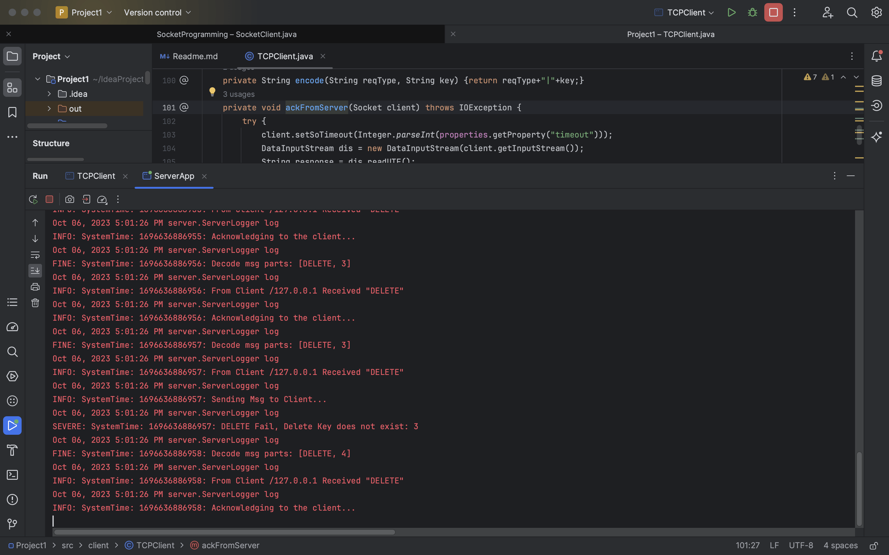
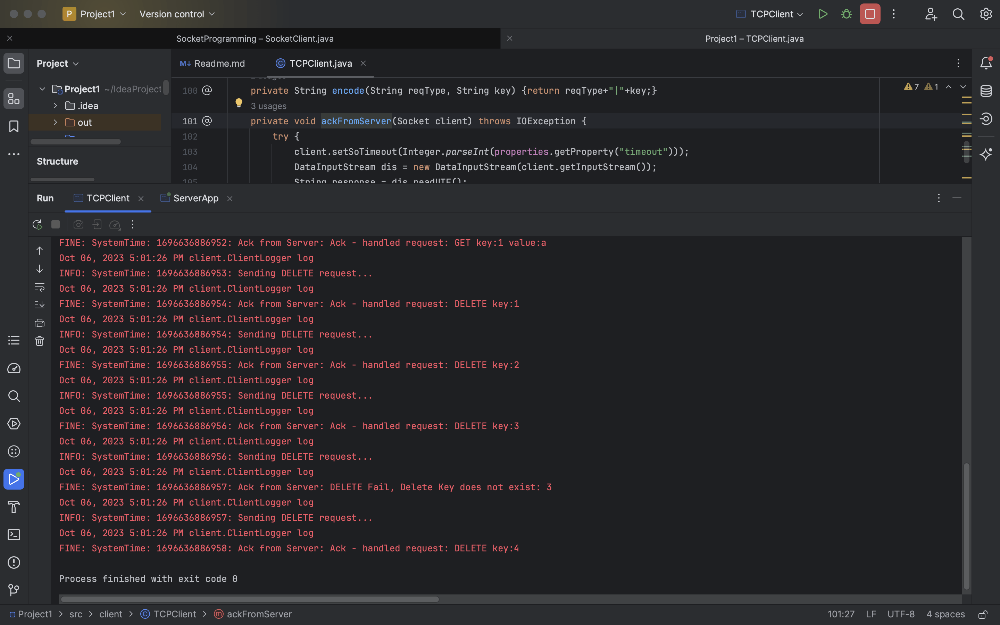
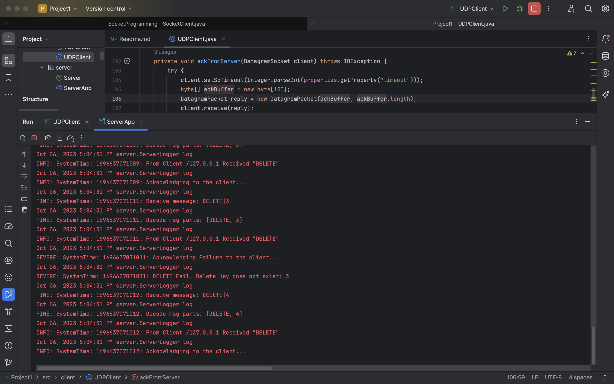
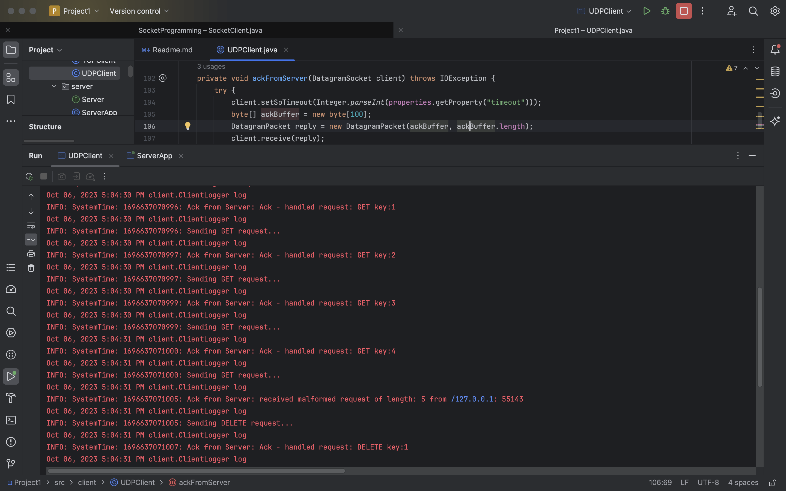

# TCP/UDP Key Value Store Project 1 - README

#### terminal screenshots
* tcp server
  
* tcp client
  
* udp server
  
* udp client
  

#### Project structure
```bash
src
├── Dockerfile
├── Project\ 1.iml
├── Project\ Submission\ Guidelines.md
├── README.md
├── client
│   ├── ClientLogger.java
│   ├── TCPClient.java
│   └── UDPClient.java
├── deploy.sh
├── run_client.sh
└── server
    ├── ServerApp.java
    ├── ServerLogger.java
    ├── TCPHandler.java
    └── UDPHandler.java

2 directories, 19 files
```
* Compile the code using `javac server/*.java client/*.java`
* server usage `java server.ServerApp <port-number> <protocol>`
* TCP client usage `java client.TCPClient <host-name> <port-number>`
* UDP client usage `java client.UDPClient <host-name> <port-number>`

#### Dockerfile

* Use any base image from [openJDK](https://hub.docker.com/_/openjdk) based on Alpine(takes less memory)
* You could use two separate Dockerfiles for client and server, or make use of multistage Dockerfile as shown below and target intermediate images

##### Example Dockerfile

```dockerfile
FROM bellsoft/liberica-openjdk-alpine-musl:11 AS client-build
COPY .. /usr/src/myapp
WORKDIR /usr/src/myapp
RUN javac client/*.java

FROM bellsoft/liberica-openjdk-alpine-musl:11 AS server-build
COPY .. /usr/src/myapp
WORKDIR /usr/src/myapp
RUN javac server/*.java
# cmd to run server locally - java server.ServerApp 5555 udp
CMD ["java", "server.ServerApp", "5555","udp"]
# to run tcp
#CMD ["java", "server.ServerApp", "1111","tcp"]

```

##### 1. Build

* Run `docker build -t <SERVER_IMAGE> --target server-build .` to build the server docker images.

##### 2. Running server

* Run `docker run -p 1111:1111/tcp -p 5555:5555/udp --name <SERVER_CONTAINER> <SERVER_IMAGE>`
* This should run your server image and expose & map the respective ports on the container
* You can now test your server container, with a copy of local client application

##### 3. Running client

* Build `docker build -t <CLIENT_IMAGE> --target client-build .`
* Run `docker run -it --rm --name <CLIENT_CONTAINER> <CLIENT_IMAGE> java client.TCPClient localhost 1111` should run the client docker image on interactive mode
* Run `docker run -it --rm --name <CLIENT_CONTAINER> <CLIENT_IMAGE> java client.UDPClient localhost 5555` should run the client docker image on interactive mode

* This can now be tested with your server running on localhost (not the docker container, yet)

Note: Both server and client docker containers are not on the local host network, so they cannot communicate with each other, yet! But, if one of the programs is running on you local env, then they will be able to communicate!
