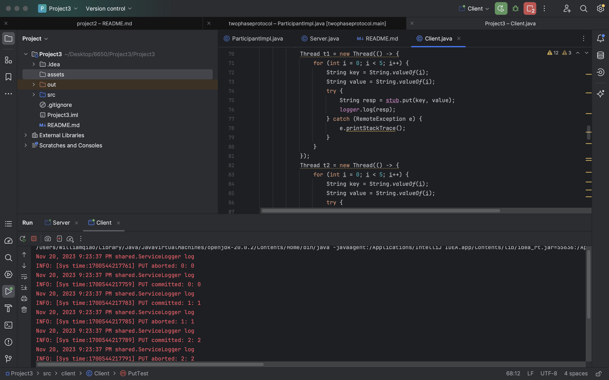

# 2 Phase commit - Key Value Store - Multi replica consistency Project 3 - README

#### terminal screenshots
* ThreadSafety
  
* ServerApp
* 

#### Summary
This project focuses on maintaining consistency across all replicas during PUT or DELETE operations. This will be achieved by implementing a two-phase commit (2PC) protocol. This protocol ensures that any changes made through PUT or DELETE requests are consistently updated across all server replicas. The assignment assumes that server failures will not occur, allowing the 2PC to proceed without stalling.

Transaction will be aborted if the key is already in any of the replicas. Lock will be released after a timeout to prevent deadlock.

#### Project structure
```bash
src
├── README.md
├── shared
│   ├──ServiceLogger.java
│   └──StoreService.java
├── client
│   ├── Client.java
│   └── TwoPhaseCommitTest.java
└── server
    ├── Coordinator.java
    ├── CoordinatorImpl.java
    ├── Participant.java
    ├── ParticipantImpl.java
    └── Server.java

2 directories, 19 files
```
* Compile the code using `javac server/*.java client/*.java shared/*.java`
* server usage `java server.Server <Coordinator-host> <Coordinator-port> <Participant-num> <Participant-host-[NUM]> <Participant-port-[NUM]>`
* client usage `java client.Client <Participant-host-[NUM]> <Participant-port-[NUM]>`
